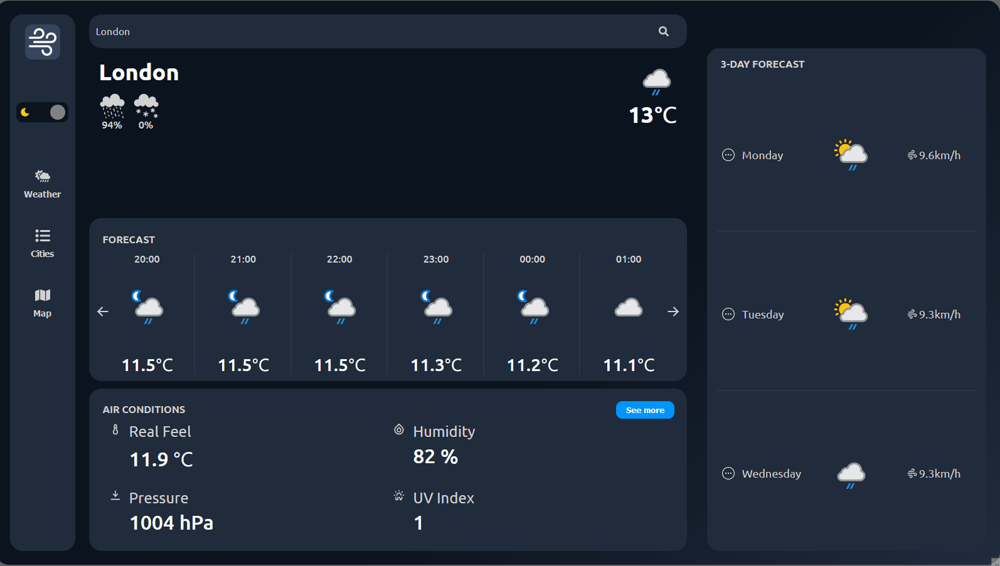
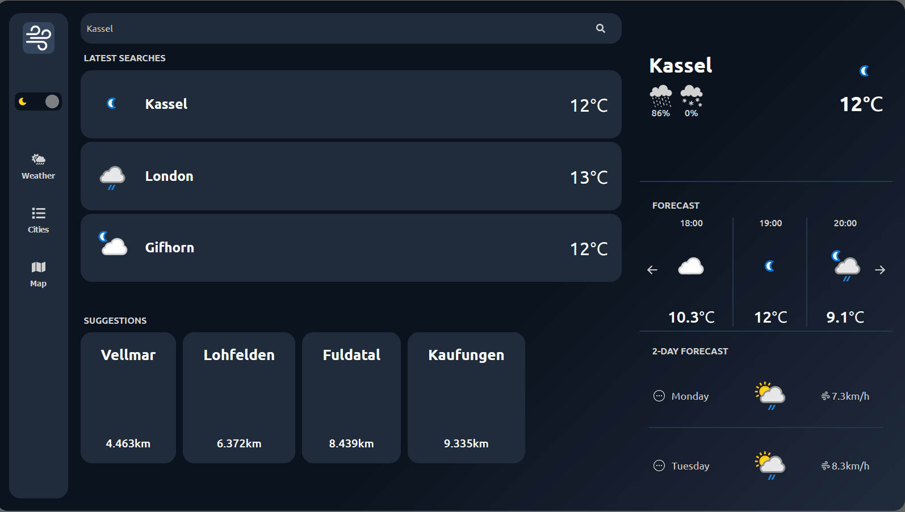
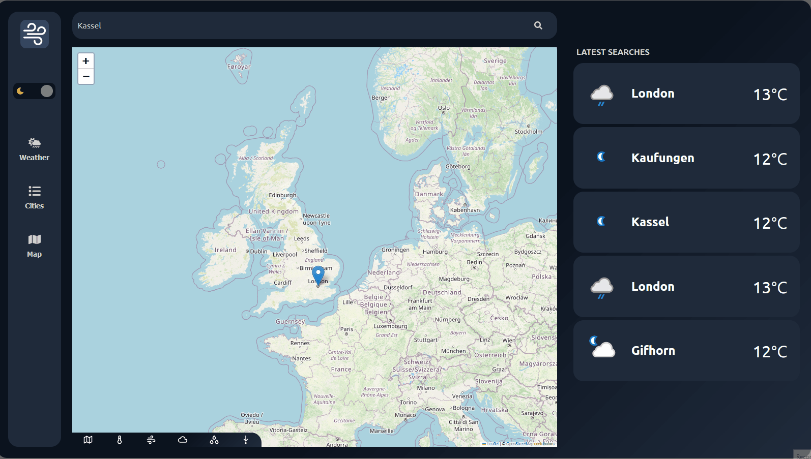
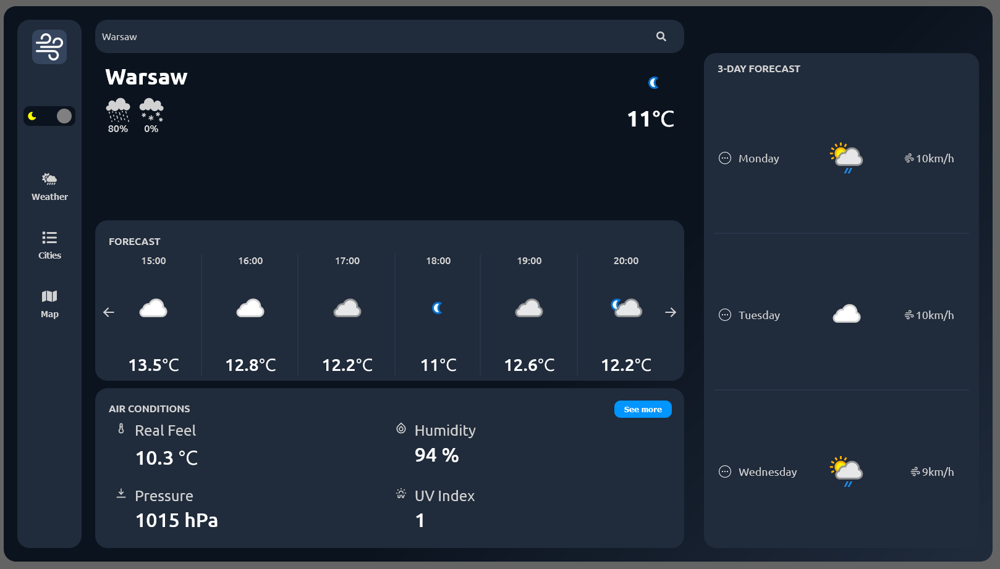
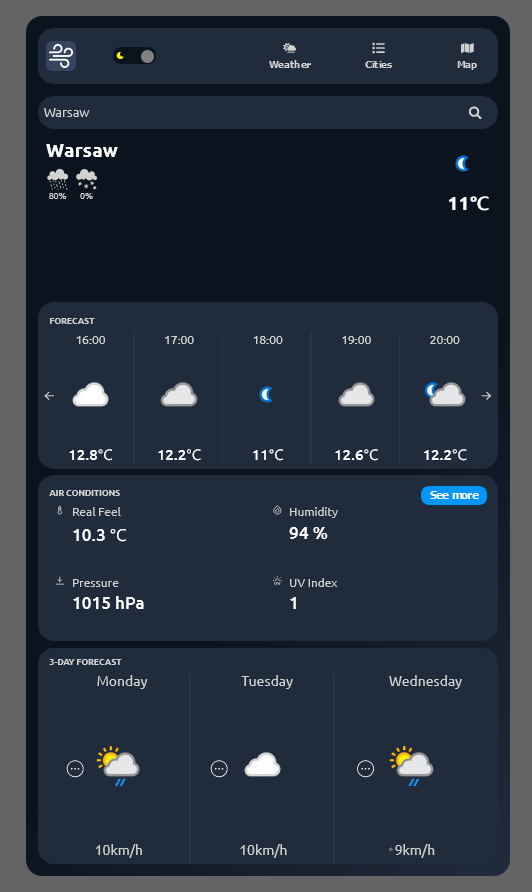

# Windue - Weather App

Windue is a simple, user-friendly application that allows you to check the current weather forecast in various locations around the world. The application offers an intuitive user interface.

# Features
## ℹ️ Basic concept
In addition to the temperature and general condition, it also shows information such as pressure, wind speed, chance of precipitation and much more.


## 📌 Geolocation
Thanks to the use of geolocation, the application can automatically find the weather for your coordinates. However, if you do not wish to provide such information, you can search for the name of your town.

The application also displays the nearest towns for which you can also check the weather


## 🗺️ Map
You can find a town on the map. Thanks to the use of OpenStreetMap API and OpenWeather API, we can enable various modes that graphically present information about temperature, wind, cloud cover, humidity and pressure.


## ☀️🌙 Theme Changer
Using the button, we can change the entire application theme with one click.


## 📏 Responsiveness
The application is fully responsive and adapts to the current resolution of your screen.
 



# 🚀 Demo
You can see the application at
https://windue-mo.netlify.app/


# 🛠️ Run Locally

Make sure you have Node and npm installed (https://nodejs.org/en)

Clone the project

```bash
  git clone https://github.com/dosmiko7/Windue-Weather-App
```

Go to the project directory

```bash
  cd Windue-Weather-App
```

Install dependencies and packages
```bash
  npm install
```

Start the server 

```bash
  npm run start
```
Open the project in your browser at the default local address http://localhost:5173/


# 💻 Tech Stack
- Node v18.14.2
- npm v8.1.0
- JavaScript
- React
- React Router
- Styled Components
- React Leaflet
- React Hot Toast


## 👨‍💻 Author

Mikołaj Oberda 
[@dosmiko7](https://www.github.com/dosmiko7)

**Design**: [design](https://uizard.io/templates/web-app-templates/weather-web-app-dark/)
